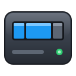
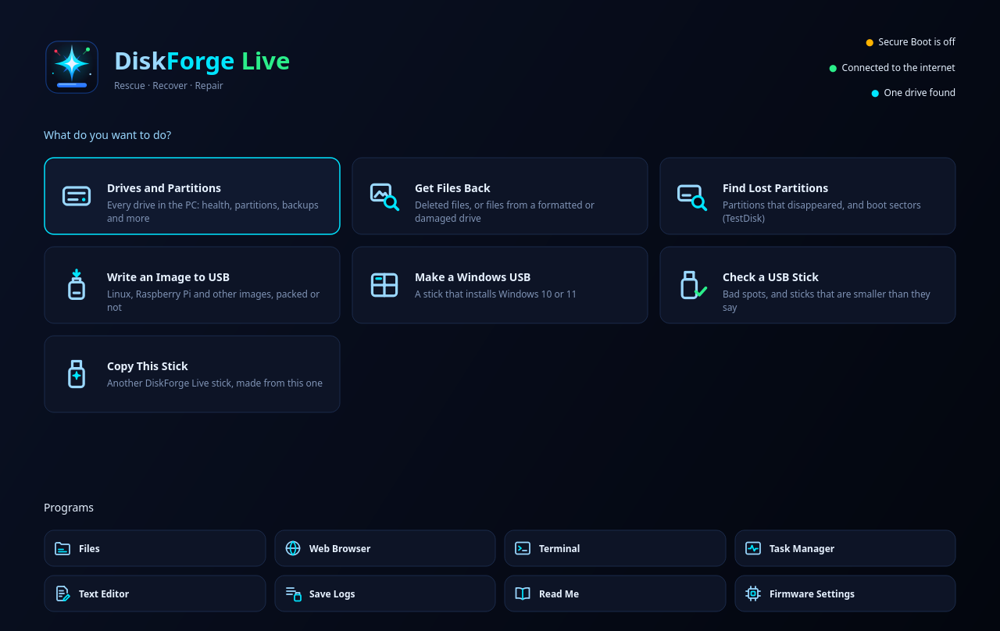

<p align="center">
  
</p>
<h1 align="center">DiskForge</h1>
<p align="center">A disk manager for Linux that looks and works like Windows Disk Management,<br>plus a rescue USB stick that can start any PC and fix its drives.</p>

I've been on Arch for a while and wanted something simple for managing drives without going to the terminal, so I
made this. It does the everyday stuff, but also the things you need when a drive is dying, a stick is fake or files
are gone. It never runs as root: changes go through udisks2 with the normal password prompt, and the drive your
system runs from is locked so you can't format it by accident.


## What it does

### &nbsp; Drives and partitions

- &nbsp; **Format**: exFAT, FAT32, NTFS, ext4, Btrfs and XFS, with encryption (LUKS) if you want it
- &nbsp; **Partitions**: create, delete, resize and rename them, set their type and flags, and make new GPT or MBR tables
- &nbsp; **Mounting**: mount, unmount and safely remove drives, or make one mount every time the PC starts
- &nbsp; **Encryption**: unlock and lock encrypted partitions, and change their passphrase
- &nbsp; **Disk images**: open .iso and .img files like a drive

What each file system supports:

| | Format | Check and repair | Resize |
|---|:---:|:---:|---|
| ext4 | ✓ | ✓ | grow and shrink (grows even while mounted) |
| Btrfs | ✓ | ✓ | grow and shrink, while mounted |
| NTFS | ✓ | basic fixes (use chkdsk in Windows for real damage) | grow and shrink, unmounted |
| FAT32 | ✓ | ✓ | grow and shrink, unmounted |
| exFAT | ✓ | ✓ | ✗ |
| XFS | ✓ | ✓ | grow only |

### &nbsp; Drive health

- &nbsp; **Disk Health**: reads the drive's own health data (SATA and NVMe) and gives a plain verdict with every reason behind it, going by the numbers Backblaze's drive stats tie to failures. A bar at the top warns you when a drive starts going
- &nbsp; **Scan for Bad Sectors**: reads every sector and draws a map (fine, slow, unreadable). Repair rewrites the unreadable blocks so the drive swaps in spare ones, and keeps everything around them
- &nbsp; **Firmware and self-tests**: runs the drive's own self-tests and checks for firmware updates through fwupd
- &nbsp; **Benchmark**: read speed on any drive, plus an optional write test with a temporary file
- &nbsp; **Power settings**: for hard drives: when to spin down, power saving, the write cache, and Sleep Now

### &nbsp; Repair and rescue

- &nbsp; **Find Lost Files**: gets deleted files back, or files off a drive that was formatted or won't open, by what's inside them. Thumbnails and a preview, each file says if it looks complete, and it only ever reads the drive it looks through
- &nbsp; **Recover Partitions**: puts a lost partition table back from GPT's backup copy, from a layout DiskForge saw before (it keeps the last 10), or by scanning the drive. It remembers the old table, so you can undo it
- &nbsp; **Rescue Copy**: copies a failing drive to an image file or another drive, easy parts first. It can stop and carry on later, its map file works with GNU ddrescue, and it can go easy on a hot or struggling drive
- &nbsp; **Check and Repair**: runs the file system's own checker (see the table above)
- &nbsp; **Inspect Partition Table**: shows the MBR, both GPT copies with their checksums, and any sector in hex. Read-only, so it works on the system drive too

Files Find Lost Files can recover:

| Kind | Types |
|---|---|
| Pictures | JPEG, PNG, GIF, BMP, WebP, HEIC, AVIF, Canon raw (CR3) |
| Documents | PDF, Word, Excel, PowerPoint, OpenDocument text, spreadsheets and presentations, EPUB |
| Video | MP4, MOV, 3GP, AVI, Ogg video |
| Music | MP3, WAV, M4A, Ogg, Opus |
| Archives | ZIP, 7-Zip, JAR, APK |
| Other | SQLite databases |

Names and folders can't come back this way, so recovered files get made-up names, sorted by kind.

### &nbsp; USB sticks

- &nbsp; **Write Image to USB**: .iso and .img files, also compressed (.xz, .gz, .bz2, .lzma, .zst, .zip), checked after writing against an MD5, SHA-1, SHA-256 or SHA-512 checksum or a SHA256SUMS file. It can also copy a Linux ISO's files so the stick stays usable, with persistence for Ubuntu and Debian live sticks
- &nbsp; **Make a Windows USB**: a Windows 10 or 11 install stick that starts with Secure Boot on. Windows 11 options: skip the TPM, Secure Boot and RAM check, no Microsoft account, a local account, skip the privacy questions, no automatic BitLocker
- &nbsp; **Check a USB Stick**: finds bad spots and fake sticks that claim more space than they have, says how much a fake one really holds, and can make it safe to use
- &nbsp; **Make a DiskForge Live USB**: puts the rescue system on a stick as normal files and makes it start UEFI and old BIOS PCs (more below)

### &nbsp; Backups, cleanup and erasing

- &nbsp; **Back Up and Restore**: a drive or partition to a compressed .img.zst file with a checksum, checked before anything is restored
- &nbsp; **Clone Drive**: copies a drive onto another one, skips empty space, can grow the last partition onto a bigger drive, and keeps the same IDs or gives new ones
- &nbsp; **Disk Usage**: a map of what's using the space on a drive
- &nbsp; **Disk Cleanup**: old package files, the cache of packages you've uninstalled, old system logs, your cache folder and the trash
- &nbsp; **Optimize Drives**: TRIM your SSDs now, or every week
- &nbsp; **Btrfs**: your snapshots (snapper), error counts, and a scrub now or every month
- &nbsp; **Wipe Disk**: overwrites every byte with zeros, and can be stopped
- &nbsp; **Secure Erase**: tells the drive to erase itself (normal or enhanced on SATA, user data or crypto erase on NVMe), and walks you through unfreezing a frozen drive. [Guide with pictures](docs/SECURE-ERASE.md)

### &nbsp; Extras

- &nbsp; **Add-ons**: your own actions in the menus, from a JSON file or the Add-on Maker, plus a signed online list to install them from. Look-only ones run in a read-only sandbox ([docs/ADDONS.md](docs/ADDONS.md))
- &nbsp; **Themes**: System, Classic, Deadshadow, High Contrast and DiskForge Live, or make your own
- &nbsp; **RAID and LVM**: software RAID arrays with their status and a check button, and LVM volume groups

## Getting it

### Arch
This installs the latest release:
```
git clone https://github.com/DannyS124/diskforge.git
cd diskforge/packaging/arch
makepkg -si
```
The PKGBUILD checks the release's sha256 and won't build if it doesn't match.

### Other distros
Every release has an AppImage and a Flatpak on the [Releases page](https://github.com/DannyS124/diskforge/releases).
For Debian and Ubuntu, `packaging/deb/build.sh` builds a .deb (it needs podman and builds in a Debian container).
They're not on Flathub, because a disk manager needs more access than Flathub allows. In the Flatpak, Disk Usage
only sees your home folder and mounted drives, and add-ons need one extra permission (see Help → Problems).

### Extra packages for some features
DiskForge never installs anything by itself. If a feature needs something, it tells you which package. These are
the ones it can use (Arch names):

| For | Install |
|---|---|
| exFAT, NTFS, XFS | `exfatprogs`, `ntfs-3g`, `xfsprogs` |
| Btrfs scrubs | `btrfs-progs` |
| Disk Cleanup (package cache), snapshot list | `pacman-contrib`, `snapper` |
| Firmware check | `fwupd` |
| LVM | `udisks2-lvm2` |
| Make a Windows USB (most Windows 11 ISOs) | `wimlib` |
| Look-only add-ons | `bubblewrap` |

## &nbsp; DiskForge Live



DiskForge Live is a small Linux system on a USB stick, with DiskForge and a few other repair tools on it. It starts
any PC, new or old, even one whose own system won't start, and it opens on the screen above. To make one:

1. Download `diskforge-live-<version>.iso` from the [Releases page](https://github.com/DannyS124/diskforge/releases).
2. In DiskForge, go to File → Make a DiskForge Live USB, pick the ISO and the stick, and type the stick's name to
   confirm.
3. Plug the stick into the PC you want to fix, turn it on and press its boot menu key (usually F12, F11, F9 or Esc),
   then pick the stick.

Made this way, the stick still works for files and keeps logs of every start. Rufus, balenaEtcher or dd work too,
but then the stick is read-only. More in [docs/DISKFORGE-LIVE.md](docs/DISKFORGE-LIVE.md).

## How do I...

**Get deleted files back?** Action → Find Lost Files, pick the drive, tick the files you want and save them to a
*different* drive. If the drive is failing, make a Rescue Copy first and look in the copy.

**Know if a drive is dying?** Right-click it → Disk Health. A bar at the top also warns you when one starts going.

**Fix a USB stick that still shows old partitions from an ISO?** Right-click it → Wipe Disk, then New Partition Table
and one new partition.

**Erase a drive for good?** Wipe Disk is enough for a hard drive. For an SSD use Secure Erase, which has its own guide
with pictures: [docs/SECURE-ERASE.md](docs/SECURE-ERASE.md).

**Save what's left on a dying drive?** Rescue Copy it to an image file or another drive, then open the copy and work
on that, never the dying drive.

The built-in Help (F1) covers everything else, step by step.

## When something goes wrong

**Every change fails with "Not authorized".** Your desktop isn't running a polkit agent. KDE and GNOME have one, but
on tiling window managers you have to start one yourself (polkit-kde-agent, polkit-gnome or hyprpolkitagent).

**It says something "needs" a package.** Install that package (see the table above) and try again.

**A drive is missing.** Press F5. Empty card readers are hidden on purpose.

**Something else.** Open an issue. If it's about a specific drive, paste the output of `diskforge --dump`. If it went
wrong while DiskForge was doing something, run `diskforge --log ~/diskforge.log`, do it again and attach the log. It
lists what DiskForge asked the system to do and what came back, never passwords.

## Updating
Help → Check for Updates tells you when there's a new version. You don't need to uninstall anything first:
```
cd diskforge && git pull
cd packaging/arch && makepkg -si
```

## Building
You need CMake, Qt 6.8 or newer (base, svg and tools), udisks2, OpenSSL, zstd, libarchive and libblkid. On Arch:
`pacman -S cmake qt6-base qt6-svg qt6-tools udisks2 openssl zstd libarchive util-linux-libs`.
```
cmake -S . -B build
cmake --build build
./build/diskforge
```
`sudo ./build/diskforge-selftest` runs every operation on a throwaway disk image, so you can test changes without
touching a real drive. `packaging/release.sh` lists the other test suites.

## Support
DiskForge is free and it's staying free. If it got your files back or saved you a trip to the computer shop and you
want to say thanks, you can buy me a coffee on Ko-fi. It helps me keep working on it.

[](https://ko-fi.com/K0C528JI83)

## License
GPL-3.0-or-later (0.3.0 and 0.4.0 were MIT).
