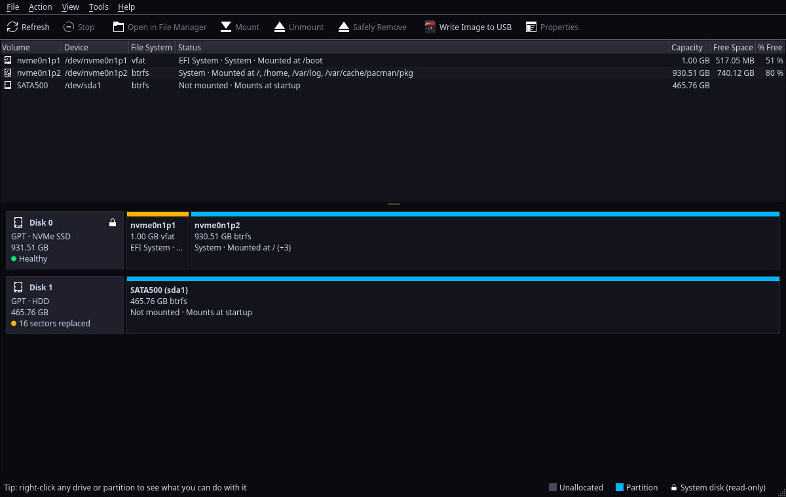

# DiskForge

A disk manager for Linux that looks and works like Windows Disk Management. I've been on Arch for
a while and wanted something simple for managing drives without going to the terminal, so I made this.



## What it does
- Mount, unmount and safely remove drives
- Format (ext4, btrfs, NTFS, FAT32, exFAT), with optional encryption
- Create, delete and resize partitions, rename volumes
- Make a new partition table (GPT or MBR), or wipe a whole disk
- Check for errors and repair
- Make a drive mount at startup
- Disk health: warns you before a drive dies and says why in plain words, scan for bad sectors (with a map of the drive) and repair them,
  check for firmware updates (fwupd), Btrfs error counts and scrubs
- Recover lost partitions (from GPT's own backup, from a layout DiskForge saw before, or by scanning the drive), and look at the
  partition table as it really is on the disk
- A Stop button for wipes and checks
- Partition type and flags, power settings for hard drives (spin-down etc.)
- Shows software RAID arrays and LVM volume groups
- Clone a drive onto another one, back up and restore drives or partitions (compressed, with checksums)
- Rescue Copy: get what you can off a dying drive, like ddrescue
- Disk Usage: see what's eating your space
- Disk Cleanup: old packages, logs, caches and the trash
- Optimize Drives (TRIM), Btrfs snapshot list, Secure Erase for SSDs (with pictures: [docs/SECURE-ERASE.md](docs/SECURE-ERASE.md))
- Write an ISO or a disk image to a USB stick, compressed ones too, as it is or with its files copied (with persistence
  for Ubuntu and Debian live sticks)
- Make a Windows 10 or 11 install stick, with the Windows 11 options (no TPM check, no Microsoft account...)
- Check a USB stick for bad spots and for being fake (smaller than it says)
- Find Lost Files: get deleted files back, or files off a drive that was formatted or won't open (pictures, documents,
  videos, music, archives), with previews before you save them
- Make a DiskForge Live USB: DiskForge Live is a rescue stick that starts any PC, new or old (UEFI or BIOS, Secure Boot is fine),
  with DiskForge on it, to fix its drives, get files back and test the memory. See [docs/DISKFORGE-LIVE.md](docs/DISKFORGE-LIVE.md)
- Open .iso and .img files like a drive
- Benchmark drive speed
- Add-ons: anyone can add their own actions (see [docs/ADDONS.md](docs/ADDONS.md)), and there's a list to install them from.
  There's an Add-on Maker too, so you don't have to write JSON
- Themes (Classic, Deadshadow, High Contrast, DiskForge Live, or make your own)

It doesn't run as root. Changes go through udisks2, so you get the normal password prompt, and the
drive your system is on is locked so you can't format it by accident.

## Install (Arch)
This installs the latest release. If there's no release on the
[Releases page](https://github.com/DannyS124/diskforge/releases) right now, build from source instead (see Building).
```
git clone https://github.com/DannyS124/diskforge.git
cd diskforge/packaging/arch
makepkg -si
```
The PKGBUILD checks the sha256 of the release tarball and won't build if it doesn't match.

For exFAT you need `exfatprogs`, for NTFS `ntfs-3g`, for XFS `xfsprogs`. Disk Cleanup uses
`pacman-contrib` for the package cache, and the snapshot list needs `snapper`. The firmware check
needs `fwupd`, LVM needs `udisks2-lvm2`, and Btrfs scrubs come with `btrfs-progs`. Make a Windows USB needs
`wimlib` for most Windows 11 ISOs (it splits the big install.wim).

DiskForge never installs anything by itself. If something's missing, it says which package it needs
(Format shows "needs exfatprogs", for example), so install that one. If every change fails with
"Not authorized", your desktop isn't running a polkit agent: KDE and GNOME have one, but on tiling
window managers you have to start one yourself (polkit-kde-agent, polkit-gnome or hyprpolkitagent).

## Other distros
Each release also has a Flatpak and an AppImage on the Releases page. For Debian and Ubuntu,
`packaging/deb/build.sh` builds a .deb (it needs podman, and does the build in a Debian container). They're not on Flathub (a disk
manager needs more access than Flathub allows). In the Flatpak, Disk Usage only sees your home folder and
mounted drives, and add-ons need one extra permission (see Help → Problems).

## Updating
Help → Check for Updates tells you if there's a new version. To update you don't need to
uninstall anything:
```
cd diskforge && git pull
cd packaging/arch && makepkg -si
```

## Building
You need CMake, Qt 6.8 or newer (base, svg and tools), udisks2, OpenSSL, zstd, libarchive and
libblkid. On Arch that's `pacman -S cmake qt6-base qt6-svg qt6-tools udisks2 openssl zstd libarchive util-linux-libs`.
```
cmake -S . -B build
cmake --build build
./build/diskforge
```
`sudo ./build/diskforge-selftest` runs every operation on a throwaway disk image, so you can test
changes without touching a real drive. There are more test suites (clone, backup, rescue and so on);
`packaging/release.sh` lists them all.

## Bugs / ideas
Open an issue. If it's about a specific disk, paste the output of `diskforge --dump`. If something went wrong
while DiskForge was doing it, run it as `diskforge --log ~/diskforge.log`, do it again and attach the log
(it lists what DiskForge asked UDisks to do and what came back, never passphrases).

## License
GPL-3.0-or-later (0.3.0 and 0.4.0 were MIT).
