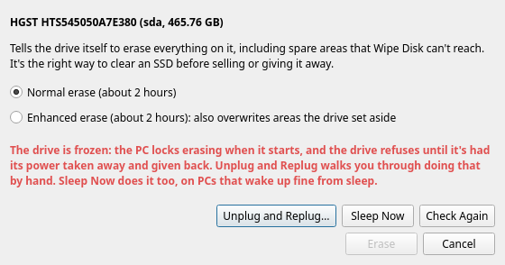
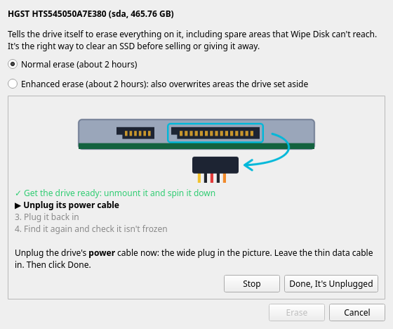
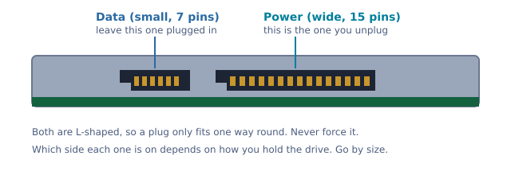
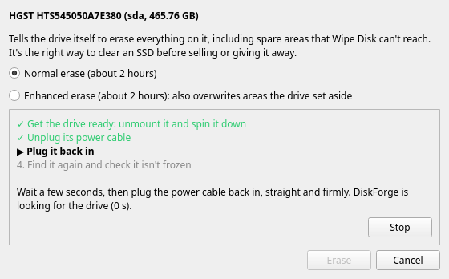
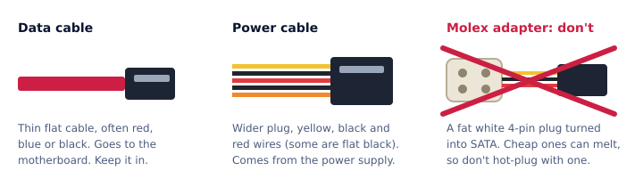
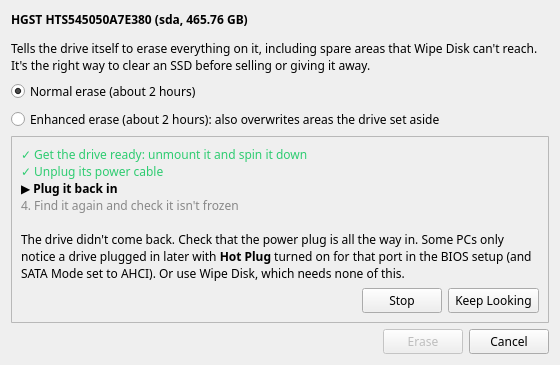

# Secure Erase, step by step

Secure Erase tells a drive to wipe itself, including the spare areas a normal wipe can't reach. That matters most
for SSDs. For an old hard drive, Wipe Disk does the job just as well and is a lot less fuss, so if that's what
you've got, skip to the end.

You'll want the drive connected inside a PC (SATA). Most USB adapters block Secure Erase, so it fails through them.
And back up anything you want to keep first, because there's no undo.

## Starting it

Right-click the drive in DiskForge, pick Secure Erase, then Normal erase. If there's no red message, type the
drive's name where it asks (something like `sda`), press Erase and wait for the bar at the top to finish. That's it.

Most of the time though, you'll see this:



## Why it says "frozen"

When a PC starts, it locks Secure Erase on every drive that has power, so nothing can erase them by accident. The
lock only goes away when the drive loses power and gets it back while the PC is already running. So that's what
we do: pull the drive's power cable for a few seconds and plug it back in.

## Unplug and Replug

Press **Unplug and Replug…** and DiskForge walks you through it.

First it unmounts the drive and spins it down, so it's safe to pull the power. Then it shows you which plug:



You need to know which cable is which. Every SATA drive has two sockets next to each other on one edge, a small one
and a wide one. The wide one is power:



Pull the power plug straight out (hold the plug, not the wires), leave the data cable where it is, and press
**Done, It's Unplugged**. Then DiskForge tells you to plug it back in:



Wait a few seconds, push the power plug back in until it's seated, and DiskForge finds the drive again by itself.
It might come back under a different name (`sde` instead of `sda`), that's normal, it goes by the serial number.
When it says it's not frozen anymore, type the name and press Erase.

## Is it safe to pull the power cable with the PC on?

It's not as scary as it sounds. SATA power plugs are made to be plugged and unplugged while the PC is running (the
pins are different lengths so power connects in a safe order), and servers swap drives like this all day. The
cable is only 5 and 12 volts, like a phone charger, so it won't shock you. The only part of a PC that can hurt you
is inside the power supply box, and you never open that.

A few things to watch:

- Touch some bare metal on the case first, to get rid of static.
- Don't do this with a Molex adapter (the fat white 4-pin plug turned into SATA). Cheap ones can melt.
- Don't touch the fans or the graphics card, and don't bump anything else.
- Never unplug the drive the system is running from.



If any of this makes you nervous, skip it and use Wipe Disk instead. Nothing is worth worrying about.

## It doesn't find the drive again

Some PCs don't notice a drive being plugged in while they're on. On DiskForge Live, DiskForge already asks the PC
to look again every few seconds, which fixes it on most older machines. On a normal Linux install it can't do that
without admin rights, so after 20 seconds it shows you a command to run in a terminal, with a Copy button:

```
echo "- - -" | sudo tee /sys/class/scsi_host/host*/scan
```

If it still doesn't show up after a couple of minutes, you'll see this:



Check the power plug is all the way in. Then go into the PC's BIOS setup (on DiskForge Live, the Firmware Settings
tile restarts into it), find the SATA settings, set SATA Mode to AHCI and turn on Hot Plug for that port. Some
older boards don't have those settings at all, and then this PC just can't do it. Wipe Disk will still work.

One warning: don't change the SATA mode on a PC whose own system starts from a SATA drive. Windows might not start
afterwards.

## What about Sleep Now?

Sleeping the PC also cuts the drive's power, so Sleep Now does the same thing without opening the case. It works on
plenty of PCs, but some don't wake up properly from sleep under DiskForge Live and freeze until you switch them off.
If that happens to you, use Unplug and Replug instead.

## If the power goes out during the erase

While it's erasing, the drive has a temporary password, `xxxx` (four small x's). If the erase gets cut off, by a
power cut or the drive being unplugged, the drive comes back locked with that password. Nothing's broken, it just
needs unlocking. Some PCs ask for a hard drive password when they start, so type `xxxx` there. Otherwise open a
terminal in DiskForge Live and run these, with your drive's name instead of `sde`:

```
sudo hdparm --user-master u --security-unlock xxxx /dev/sde
sudo hdparm --user-master u --security-disable xxxx /dev/sde
```

Then run the Secure Erase again, since the first one didn't finish. A battery backup (UPS) helps, or just don't
start a long erase in the middle of a thunderstorm.

## Or just use Wipe Disk

Right-click the drive, Wipe Disk, type its name and watch the bar. It needs no unlocking, works through USB, and on a
hard drive it overwrites every spot your data was. The only thing it can miss is the handful of bad spots a drive has
already retired. If the data is really sensitive and the drive is old or dying anyway, taking it apart or drilling
through the platters is the sure way.
